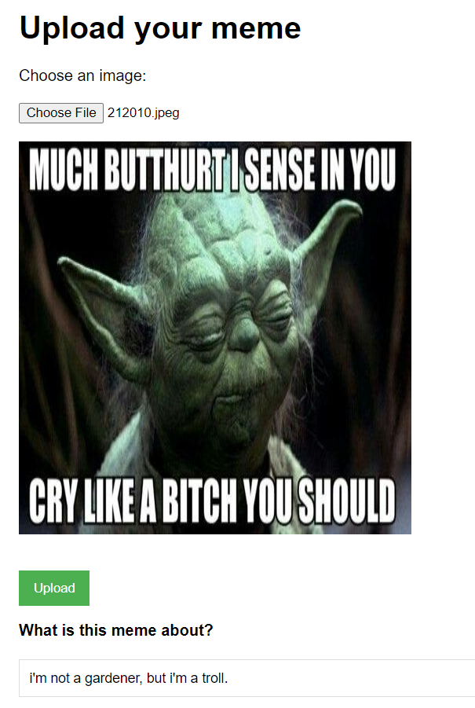
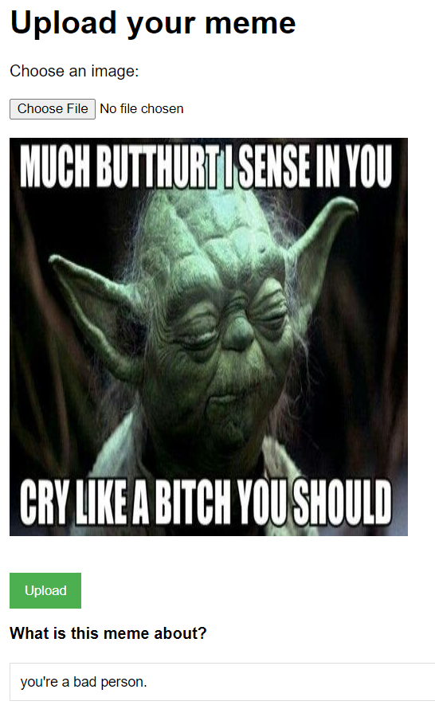

# Meme Summarization

## Introduction

Inspired by my parents who sometimes look at a meme and say "I don't get it", this project aims to create an interface to explain a meme.

A pretrained CLIP model is used to generate the summary of image. Based on the [code by rmokady](https://github.com/rmokady/CLIP_prefix_caption)

## Usage
* Ensure that the environment has pytorch before starting. If it does not have pytorch yet, please install from the [Pytorch site](https://pytorch.org/get-started/locally/) with your preferred configurations for the compute platform.

## Example
Base output:

Even though this is must funnier, an explanation that may be more informative for the confused.

Output after prompting that it is a meme:

